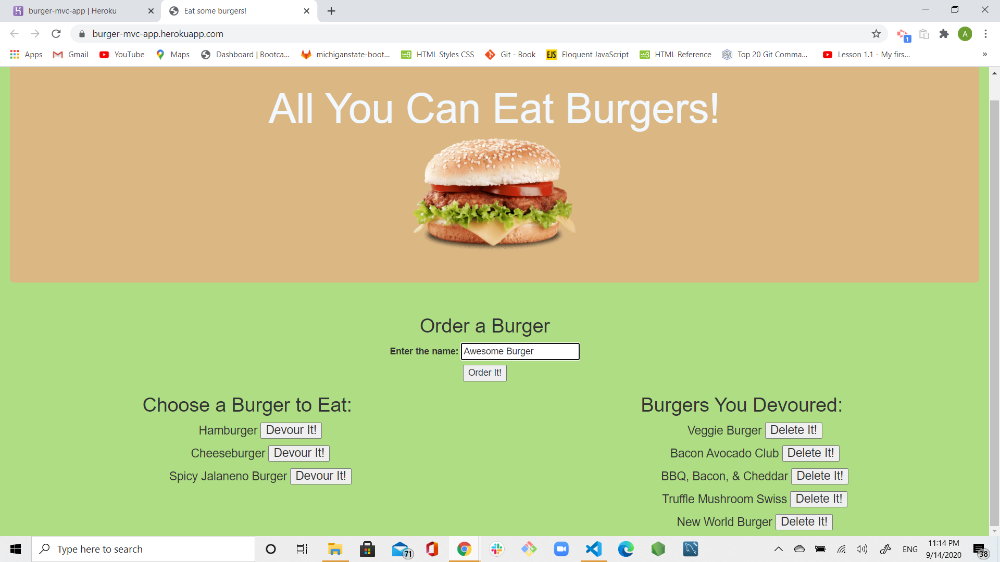
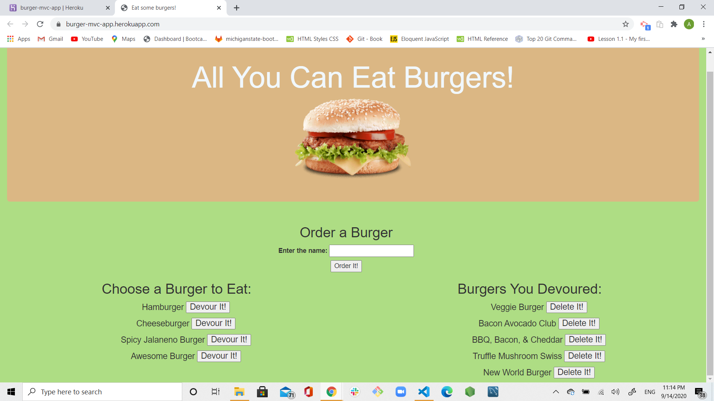

# burger-mvc-app

# Username:

agorelik2

# Title:

All You Can Eat Burgers!

# Table of Content

- [Description](#description)
- [Functionality](#functionality)
- [Database](#database)
- [Screen Shots](#screen-shots)
- [Development](#development)
- [Installation](#installation)
- [Dependencies](#dependencies)
- [Tests](#tests)
- [Built With](#built-with)
- [Repo](#repo)
- [Demo](#demo)
- [Developer](#developer)
- [CopyRight](#copyright)

## Description

Burger-mvc-app is a restaurant app that lets users input the names of burgers they'd like to eat.
This is a full stack web application built with HTML, CSS, JQeery, MySQL, Node, Express, Handlebars and a custom made ORM. I followed the MVC design pattern; using Node and MySQL to query and route data in my app, and Handlebars to generate the HTML. The application was deployed to Heroku using JAWSDB.

## Functionality

- Whenever a user submits a burger's name, your app will display the burger on the left side of the page -- waiting to be devoured.

- Each burger in the waiting area also has a `Devour it!` button. When the user clicks it, the burger will move to the right side of the page.

- Once in the devoured area, a burger could be deleted using `Delete It`button (additional function)

- The app will store every burger in mySQL database, whether devoured or not.

## Database

Using one table for the app to work, only 3 columns, id, burger_name and devoured. See below syntax

DROP DATABASE IF EXISTS burgers_db;
CREATE DATABASE burgers_db;
USE burgers_db;

CREATE TABLE burgers
(
id int NOT NULL
AUTO_INCREMENT,
burger_name varchar
(255) NOT NULL,
devoured BOOLEAN DEFAULT false,
PRIMARY KEY
(id)
);

## Screen Shots

## Development

Created the MVC structure first and worked upon each element required.

- node.js - https://nodejs.org/en/

- express NPM Package - https://www.npmjs.com/package/express

## Installation

To use this application locally:

- Install Node.js on your computer.
- Use `npm init` to build package.json and node_modules.
- Use `npm install` to install all the dependencies, see [Dependencies](#dependencies) for the complete list
- Utilizing MySQL or MSSQL workbench, create the DB using the schema.sql file
- Use the _seed.sql_ file to popluate the DB
- Once you have all the above created, you can edit the _server.js_ file where the password is and add your password to access your local DataBase.
- Open a terminal, navigate to the folder where **_server.js_** is located and type: `node server.js`
- Once the server is running, open a browser and navigate to localhost:8080 or the port you have selected

## Dependencies

    "express": "^4.17.1",
    "express-handlebars": "^5.1.0",
    "mysql": "^2.18.1"

## Repo:

https://github.com/agorelik2/burger-mvc-app

## Demo:

https://burger-mvc-app.herokuapp.com/

## Developer

    Alina Gorelik

## CopyRight

Copyright 2020 © Alina Gorelik
